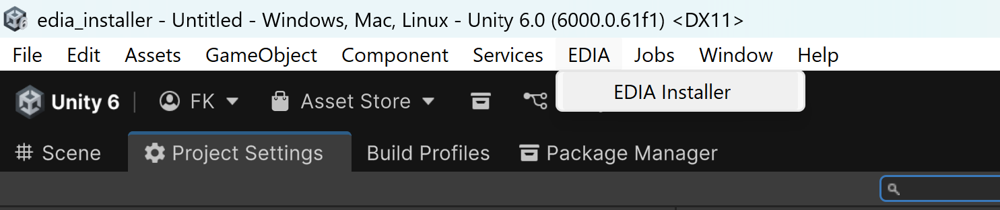

# EDIA Installer 

A one-script repo.  

Single Editor-script which allows handling the installation of the various EDIA modules and their core XR dependecies (including loading relevant samples).  

## Installation
**Recommended:**
Simply download and import the [unitypackage](./Packages/EdiaInstaller.unitypackage) to your Unity project. This will give you the following entry in your menu bar:      

> [!IMPORTANT]  
> You should and need _not_ have installed any dependencies of EDIA manually to the project, yet—the installer will take care of this. Also, make sure that you do **not** have UXF installed to the project, which would cause conflicts with EDIA (which brings its own UXF-clone). 

Alternatively, you can clone this repo -> open "EDIA > EDIA Installer" from the main menu, and take it from there to build a project from scratch.   

## Roadmap
- [ ] add `EDIA Eye` submodules
  - [ ] Quest
  - [ ] PICO
  - [ ] Vive
  - [ ] Varjo
- [x] add `EDIA RCAS`
- [x] allow to install releases (not only branches) 

