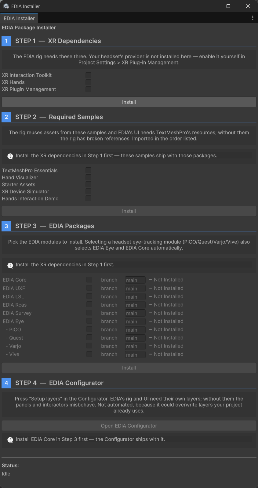

# EDIA Installer 

A one-script repo.  

Single Editor-script which allows handling the installation of the various EDIA modules and their core XR dependecies (including loading relevant samples).  

Covers every EDIA module currently shipped from [edia-toolbox](https://github.com/edia-toolbox): **EDIA UXF**, **EDIA Core**, **EDIA LSL**, **EDIA Rcas**, **EDIA Survey**, **EDIA Eye** and its headset-specific sub-modules (PICO, Quest, Varjo, Vive). Selecting a headset module automatically also selects EDIA Eye and EDIA Core, since those are required; EDIA Core in turn pulls in EDIA UXF.

## Installation

**Recommended:** download the [latest unitypackage](https://github.com/edia-toolbox/edia_installer/releases/latest/download/EdiaInstaller.unitypackage) and import it into your Unity project (menu: `Assets > Import Package > Custom Package`). The installer wizard opens by itself once Unity has compiled the imported script. It is also always available from the menu bar. Alternatively, clone this repo -> open **"EDIA > Installer"** from the main menu, and take it from there to build a project from scratch.

 Installer menu entry" src="./docs/installer-menu.png" />

> [!IMPORTANT]  
> You need _not_ install any of EDIA's dependencies manually — the installer takes care of them. Do make sure you do **not** have the upstream UXF installed in the project: it conflicts with EDIA's own UXF fork, which the installer brings in.

## How it works

The wizard walks through four steps.

1. **XR Dependencies** — installs Unity's XR Interaction Toolkit and XR Hands, plus XR Plugin Management. No provider plug-in is installed automatically.
2. **Required Samples** — imports TextMeshPro's essential resources and the samples the EDIA rig reuses: XR Hands' *Hand Visualizer*, XRI *Starter Assets*, *XR Device Simulator* and *Hands Interaction Demo*.
3. **EDIA Packages** — tick the modules you want. Dependencies are selected automatically and shown locked.
4. **EDIA Configurator** — opens the Configurator so you can press *Setup layers*. EDIA's rig and UI depend on their own layers.

No provider plug-in is installed automatically so you need to add that yourself. 

By default the `main` branch is used of each package, but in specific situations, you can specify a custom branch in the **branch** field.

Bring some patience after clicking `Install`. Unity takes a while (for anything), and installing packages triggers domain reloads — the installer resumes its queue automatically after each one. Wait for the final domain refresh before judging any remaining console errors.

## Roadmap
- [x] add `EDIA Eye` submodules
  - [x] Quest
  - [x] PICO
  - [x] Vive
  - [x] Varjo
- [x] add `EDIA RCAS`
- [x] add `EDIA Survey`
- [x] allow to install releases (not only branches) 
- [x] cover the XR provider, TextMeshPro essentials and the manual project settings
- [ ] drop the forced `EDIA UXF` dependency once a Core release ships with UXF absorbed
